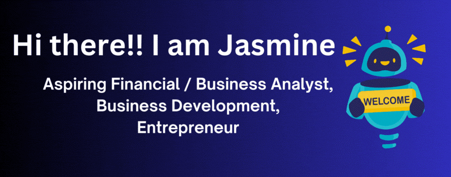

**About me**

I am a dynamic and results-driven Analytics and Business Intelligence professional with 4+ years of experience in financial analysis, 
budgeting, forecasting, and project management. 

- 🎓 I recently graduated with from Boston University with a Master's in Business Analytics 
- 🌐 Visit my portfolio website to get know me know better and my story!
- 🌍 I currently reside at Boston, MA 
- 📊 I am currently looking for Financial Analyst / Business Analyst roles
- 📄 Check out my [resume!]()

**Skills**

**Connect with me** 

